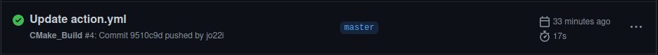

# Отчёт по лабораторной работе №4

## Выполнил: студент группы ИУ8-22 Мельников Егор

## Homework

Вы продолжаете проходить стажировку в "Formatter Inc.".

В прошлый раз ваше задание заключалось в настройке автоматизированной системы **CMake**.

Сейчас вам требуется настроить систему непрерывной интеграции для библиотек и приложений, с которыми вы работали в прошлый раз. Настройте сборочные процедуры на различных платформах:
* используйте `GitHub Actions` для сборки на операционной системе **Linux**.

1. Создаём репозиторий и копируем необходимые библиотеки и файлы.

2. Создаём директорию `.github/workflows` и добавляем в неё файл `actions.yml`.

3. Заполняем файл `actions.yml` следующим содержимым и пушим в репозиторий.

```yaml
 
 ​name​: ​CMake_Build 
  
 on​: 
 ​  ​push​: 
 ​    ​branches​: ​[ master ] 
 ​  ​pull_request​: 
 ​    ​branches​: ​[ master ] 
  
 ​  ​#​ Allows you to run this workflow manually from the Actions tab 
 ​  ​workflow_dispatch​: 
  
 ​jobs​: 
 ​  ​Build​: 
 ​    ​runs-on​: ​ubuntu-latest 
 ​     
 ​    ​steps​: 
 ​    - ​name​: ​checkout 
 ​      ​uses​: ​actions/checkout@v3 
 ​       
 ​    - ​name​: ​Creating directory for future compiled artefacts 
 ​      ​run​: ​| 
 ​        mkdir artifacts 
 ​     
 ​    - ​name​: ​Build a *formatter* library 
 ​      ​run​: ​| 
 ​        cmake -H. -B_build 
 ​        cmake --build _build 
 ​        mv _build formatter_lib_build 
 ​        mv formatter_lib_build ../artifacts 
 ​      ​shell​: ​bash 
 ​      ​working-directory​: ​formatter_lib 
 ​       
 ​    - ​name​: ​Build a *formatter_ex* library 
 ​      ​run​: ​| 
 ​        cmake -H. -B_build 
 ​        cmake --build _build 
 ​        mv _build formatter_ex_lib_build 
 ​        mv formatter_ex_lib_build ../artifacts 
 ​      ​shell​: ​bash 
 ​      ​working-directory​: ​formatter_ex_lib 
 ​       
 ​    - ​name​: ​Build a *hello_world* application 
 ​      ​run​: ​| 
 ​        cmake -H. -B_build 
 ​        cmake --build _build 
 ​        mv _build hello_world_build 
 ​        mv hello_world_build ../artifacts 
 ​      ​shell​: ​bash 
 ​      ​working-directory​: ​hello_world_application 
 ​       
 ​    - ​name​: ​Build a *solver* library 
 ​      ​run​: ​| 
 ​        cmake -H. -B_build 
 ​        cmake --build _build 
 ​        mv _build solver_lib_build 
 ​        mv solver_lib_build ../artifacts 
 ​      ​shell​: ​bash 
 ​      ​working-directory​: ​solver_lib 
 ​       
 ​    - ​name​: ​Build a *solver* application 
 ​      ​run​: ​| 
 ​        cmake -H. -B_build 
 ​        cmake --build _build 
 ​        mv _build solver_app_build 
 ​        mv solver_app_build ../artifacts 
 ​      ​shell​: ​bash 
 ​      ​working-directory​: ​solver_application 
 ​       
 ​    - ​name​: ​Push artifacts into repo 
 ​      ​uses​: ​actions/upload-artifact@v3 
 ​      ​with​: 
 ​        ​path​: ​artifacts
```

4. Смотрим на результаты работы `GitHub Actions` во вкладке `Actions`.


